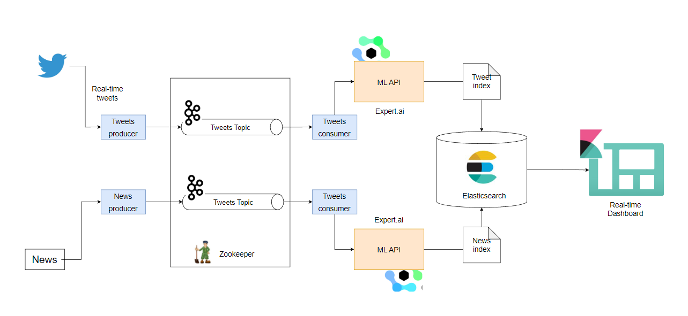
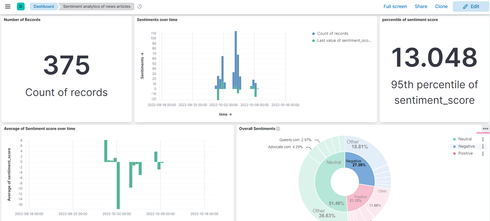

# Reddit Hate Speech & Sentiment Analysis

A real-time analytics pipeline for detecting hate speech on Reddit and analyzing the sentiment of news media articles, with results visualized in a live dashboard.

---

## Features

- **Hate Speech Detection:** Identifies hate speech in Reddit posts using NLP.
- **Sentiment Analysis:** Analyzes sentiment in news articles related to tracked entities.
- **Real-Time Pipeline:** Data is processed and visualized live, with the dashboard refreshing every 10 seconds.
- **Kafka Integration:** Producers and consumers communicate via Apache Kafka topics.
- **Elasticsearch & Kibana:** Processed data is indexed and visualized for analytics.

---

## Architecture



- **Data Producers:**
  - Reddit producer: Streams Reddit posts.
  - News producer: Streams news articles.
- **Data Consumers:**
  - Reddit consumer: Detects hate speech and classifies posts.
  - News consumer: Analyzes sentiment in articles.
- **Apache Kafka:**
  - Two topics for Reddit and news, each with 2 partitions and 2 replicas.
- **Elasticsearch & Kibana:**
  - Separate indexes for Reddit and news data, visualized in Kibana.

---

## Directory Structure

```
hate_speech_pipeline/
    config.py
    model.py
    reddit_consumer.py
    reddit_dashboard.py
    reddit_producer.py
    test.py
    templates/
        reddit_dashboard.html
images/
    dashboard_ss1.png
    discover_ss1.png
    proj_arch.png
config.yml
docker-compose.yml
Dockerfile
env.example
requirements.txt
README.md
```

---

## Setup Instructions

1. **Clone the repository:**

   ```sh
   git clone https://github.com/Dinesh052/Reddit-Hate-speech-Analysis.git
   cd Reddit-Hate-speech-Analysis
   ```

2. **Create a virtual environment and install dependencies:**

   ```sh
   python -m venv venv
   venv\Scripts\activate
   pip install -r requirements.txt
   ```

3. **Configure environment variables:**

   - Copy `env.example` to `.env` and fill in your credentials.

4. **Start the services with Docker:**

   1st terminal
   docker-compose up --build
   
   2nd terminal 
   python -m hate_speech_pipeline.reddit_producer

   3nd terminal
   python -m hate_speech_pipeline.reddit_consumer

   4th terminal
   python -m hate_speech_pipeline.reddit_dashboard

   5th terminal
   uvicorn hate_speech_pipeline.reddit_dashboard:app --reload

5. **Run the pipeline:**
   - Start the Reddit and news producer/consumer scripts as needed.
   - Access the dashboard at the provided URL (see `reddit_dashboard.py` for details).

---

## APIs Used

- [Reddit API](https://www.reddit.com/dev/api/)
- [NewsAPI](https://newsapi.org/)
- [Expert.ai NLP API](https://www.expert.ai/)

---

## Dashboard

- Live dashboard auto-refreshes every 10 seconds.
- Visualizes hate speech and sentiment trends.



---

## License MMM

MIT License
